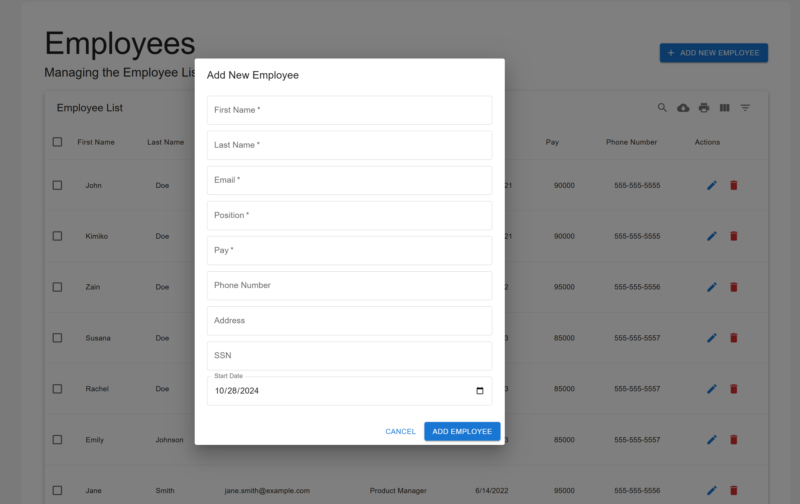

# Orion Employment Management  

## Description   
A company management application for Administrators and lower level employees. Designed to streamline HR processes and enhance organizational efficiency. Our user-friendly tool empowers HR professionals to effectively manage employee data, track time-off requests, and maintain clear communication within the organization.   

## Table of Contents
* Description  
* Usage    
* Developers   
* Repository Link    
* Render Link    
* Application screenshots    
* License     

## Usage     
**User Story**  
As an Orion employee  
I want to be able to log in or sign up for the company application    
So that I can update my information if necessary  
I want to be able to sign up on the company webpage  
So that I can request time off and check the status of my requests.  

As an admin user  
I want to use my admin login  
So that I can view all employees, add or delete employees, update employee details, an approve or deny time off requests.  

**Acceptance Criteria**  
GIVEN the Orion Employee Management application,    
WHEN I access the company’s employee management site,    
THEN I can choose to log in or sign up for a new account.  

WHEN I log in as an admin,  
THEN I can view employee records, approve or deny time-off requests, update employee files, and add or delete employees.  

WHEN I log in as an employee,  
THEN I can view my profile, request time off, see the status of my time-off requests, and update my personal details.  

## Developers

Zain ul Abid - zainabid333  
Kimiko Dixon - Kimiko-Dixon  
Susana Soto - ssoto83  

## Repository Link   
https://github.com/ssoto83/Orion-Employment-Management.git  

## Render Link  
https://orion-employment-management.onrender.com  

## Application Screenshots

  
  
  
  
  
    
   
     

## License
This project is licensed under the MIT License. See the [LICENSE](LICENSE) file for details.

